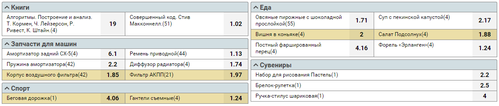

## Описание

Реализовать вывод списка товаров с возможностью добавления в корзину по примеру (дизайну следовать не обязательно):

Описание ключей в файле products.json:
- "C" - цена товара в долларах
- "G" - id группы
- "T" - id товара
- "P" - количество

Файл names.json содержит названия групп и товаров по id

## Задачи

1. Реализовать получение данных из файлов products.json и names.json с помощью HTTP клиента по интервалу 15 секунд
2. Вывести список товаров в наличии по группам, реализовать возможность добавления товара в корзину
3. Обновлять курс доллара на рандомное значение от 50 до 80 раз в 20 секунд, при обновлении курса цена товаров должна изменяться. 
Если стоимость товара увеличивается, то подсвечивать ячейку с ценой товара красным, если уменьшается - зелёным
4. Корзина должна содержать итоговую цену всех товаров и сохранять своё состояние после перезагрузки страницы

Обязательно использовать:
- [next.js](https://nextjs.org/)
- [typescript](https://www.typescriptlang.org/)
  
По желанию:
- [storeon](https://github.com/storeon/storeon)
- [chakra UI](https://chakra-ui.com/) или вёрстку с использованием [emotion](https://github.com/emotion-js/emotion)
   
